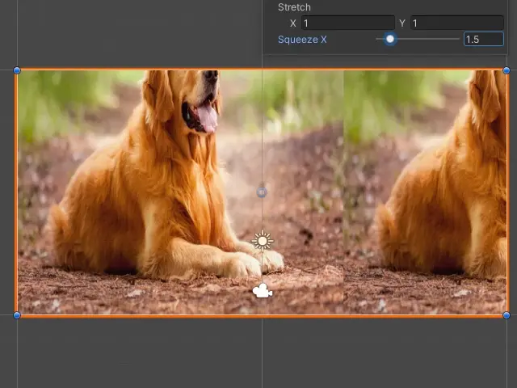
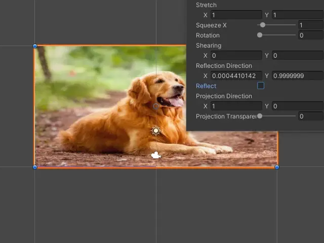

# Applications of Matrix in computer graphics | Transform matrices <!-- omit in toc -->

> **Table of contents**
>
>- [What's this about?](#whats-this-about)
>- [Transformation Matrix](#transformation-matrix)
>- [Stretch](#stretch)
>- [Squeeze](#squeeze)
>- [Rotate](#rotate)
>- [Shearing](#shearing)
>- [Reflection](#reflection)
>- [Orthogonal Projection](#orthogonal-projection)

## What's this about?

Matrices are used everywhere around us nowadays. In our computers, tablets, phones, cars, wrist watches and almost any other form of machine with a tiny logical core/chip inside it. So let's take a look at just one tiny section of applications this special form of data brings to the table: use in computer graphics.  
Due to the age and completeness of matrices, it's impossible to write about all it's uses in just one article, so like any other normal article, we'll focus on a certain section of it's applications. The one that's more visual and fun! **Transformation Matrices**.

(we're specifically using 2D examples for simplicity of visualization, but transform matrices are used in other spaces too.)

## Transformation Matrix

As [wikipedia](https://en.wikipedia.org/wiki/Transformation_matrix) puts it,  
> In linear algebra, linear transformations can be represented by matrices. If $T$ is a linear transformation mapping $\mathbb R^n$ to $\mathbb {R}^{m}$ and $x$  is a column vector with $n$ entriesm then  
> $${T({x} )=A{x} }$$
> for some $m\times n$ matrix $A$, called the **transformation matrix** of $T$.

In simple words, with the help of transformation mtrix, we can *stretch*, *squeeze*, *rotate*, *shear*, *reflect* and *do ortho projection* on any given point in space. Let's do all of them one by one!  
Before we begin, we must learn how a transform matrix even works. What's the structure and how are the inputs and outputs. Here's a rough form of any transform matrix $T$ in a 2D space, that transforms the point $P$ to the point $P'$ :
$${\begin{bmatrix}P'_x\\P'_y\end{bmatrix}}={\begin{bmatrix}T_{11}&T_{12}\\T_{21}&T_{22}\end{bmatrix}}.{\begin{bmatrix}P_x\\P_y\end{bmatrix}}$$
Now that we know the general form, let's go into definitions and examples for each transform matrix!

## Stretch

> **What's stretch?** stretch is when you push the points away from a certain *pivot*  

The transformation matrix $T$ for stretching a point by $a$ along $x$, $b$ along $y$ and $c$ along $z$, in other words by $S=(a, b)$, would be
$$T=\begin{bmatrix}a&&0\\0&&b\end{bmatrix}$$
so if we want to stretch the point $P=(1, 4)$ by $S=(1.5, 3)$, we'd have

$$\begin{bmatrix}S_x&&0\\0&&S_y\end{bmatrix}P=
\begin{bmatrix}1.5&&0\\0&&3\end{bmatrix}\begin{bmatrix}1\\4\end{bmatrix}=
\begin{bmatrix}1.5\\12\end{bmatrix}$$
To get a better realization of the transformation, we'll write a shader to demonstrate it. The shader will transform the UVs (the position where each pixel of the image will be read from, for each pixel of the screen) by a simple stretch transformation matrix.

> **What are shaders ?** shaders are scripts for instructions on how the computer's graphics system will render a pixel. Given a set of textures/images and values, we can technically create shaders to visualize any form of visualization that our eyes can see.

## Squeeze

> **What's sqeeze?** sqeeze is when you take stretch alnog an axis by a constant $k$ and then stretch along the remaining axices by $1/k$. Imagine when a ball hits the ground in cartoons. So technically squeeze matrix is a subset of stretch matrix.

The transformation matrix $T$ for squeezing a point by $k$ along $x$ axis in a 2D space would be

$$T=\begin{bmatrix}k&&0\\0&&1/k\end{bmatrix}$$
so if we want to squeeze the point $P=(1, 4)$ by $k=2$ along $x$ axis, we'd have
$$\begin{bmatrix}k&0\\0&1/k\end{bmatrix}P=
\begin{bmatrix}2&0\\0&1/2\end{bmatrix}\begin{bmatrix}1\\4\end{bmatrix}=
\begin{bmatrix}2\\2\end{bmatrix}$$

And this will be the result of squeezing an image, written in a shader:

## Rotate

The transformation matrix $T$ for rotating a point by angle $\theta$ clockwise around the origin would be:
$$T=\begin{bmatrix}\cos{(\theta)}&&-\sin{(\theta)}\\\sin{(\theta)}&&\cos{(\theta)}\end{bmatrix}$$
so if we want to rotate the point $P=(1, 4)$ by $\theta=\pi/2$, we'd have
$$\begin{bmatrix}\cos{(\theta)}&&-\sin{(\theta)}\\\sin{(\theta)}&&\cos{(\theta)}\end{bmatrix}P=
\begin{bmatrix}\cos{(\pi/2)}&&-\sin{(\pi/2)}\\\sin{(\pi/2)}&&\cos{(\pi/2)}\end{bmatrix}\begin{bmatrix}1\\4\end{bmatrix}=
\begin{bmatrix}-4\\1\end{bmatrix}$$

Then using shader to visualize the rotation matrix, we'll see how a rotation transform can manipulate an image:

## Shearing

>**What's shearing?** shearing is an effect that in simple words, turns a rectangle into a parallelogram.

The transformation matrix $T$ for shearing a point by $k_x$ over $x$ axis and $k_y$ over $y$ axis would be:
$$T=\begin{bmatrix}1&&k_x\\k_y&&1\end{bmatrix}$$
so if we want to shear the point $P=(1, 4)$ by $k_x=2$ along the $x$ axis and by $k_y=3$ along the $y$ axis, we'd have
$$\begin{bmatrix}1&k_x\\k_y&1\end{bmatrix}P=
\begin{bmatrix}1&2\\3&1\end{bmatrix}\begin{bmatrix}1\\4\end{bmatrix}=
\begin{bmatrix}9\\7\end{bmatrix}$$

Then using shader to show it in action, the following result will be seen:

## Reflection

The transformation matrix $T$ for reflecting a point $P$ over a vector with direction $l=(l_x, l_y)$ that goes through origin, would be:
$$T=\begin{bmatrix}l_x^2-l_y^2&2l_xl_y\\2l_xl_y&l_y^2-l_x^2\end{bmatrix}$$

so if we want to reflect the point $P=(1, 4)$ over a vector with direction $l=(1, 0)$ that goes through the origin, we'd have
$$\begin{bmatrix}l_x^2-l_y^2&2l_xl_y\\2l_xl_y&l_y^2-l_x^2\end{bmatrix}P=
\begin{bmatrix}1^2-0^2&2\times 1\times 0\\2\times 1\times 0&0^2-1^2\end{bmatrix}\begin{bmatrix}1\\4\end{bmatrix}=
\begin{bmatrix}1\\-4\end{bmatrix}$$

And similarly in a shader, we'll see the following visualization of the reflection transformation matrix:

## Orthogonal Projection

> **What's Orthogonal projection?** it's similar to scalar projection. The result of a point over an orthogonal projection is it's shadow over the vector coming from origin towards an specific direction  

The transformation matrix of $T$ for orthogonal projection of a point $P$ over a vector with direction $u=(u_x, u_y)$ that goes through origin, would be:
$$T=\begin{bmatrix}u_x^2&u_xu_y\\u_xu_y&u_y^2\end{bmatrix}$$  

so if we want to do orthogonal projection on the point $P=(1, 4)$ over a vector with direction $u=(0.5, 0.5)$ that goes through the origin, we'd have
$$\begin{bmatrix}u_x^2&u_xu_y\\u_xu_y&u_y^2\end{bmatrix}P=
\begin{bmatrix}0.5^2&0.5\times 0.5\\0.5\times 0.5&0.5^2\end{bmatrix}\begin{bmatrix}1\\4\end{bmatrix}=
\begin{bmatrix}1.25\\1.25\end{bmatrix}$$

To visualize the effect in shaders, here's a showcase that draws the orthogonal projection of an image with the given direction and blends it with the normal image:

